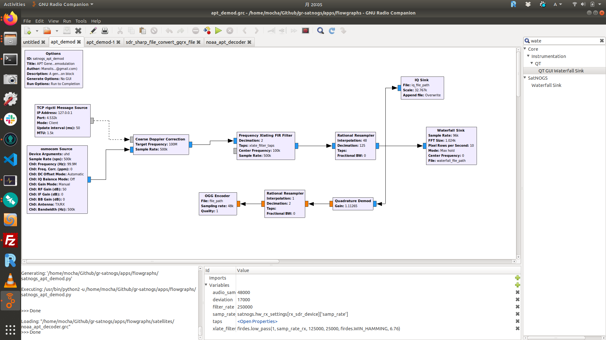
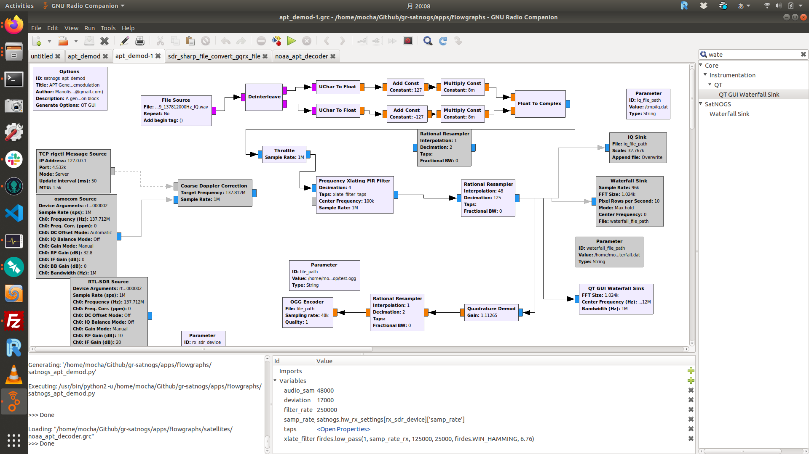

# apt_demod
- Ref. [1] https://gitlab.com/librespacefoundation/satnogs/gr-satnogs/blob/master/apps/flowgraphs/apt_demod.grc
    - apt_demod.grc
    
- Ref. [2] https://gitlab.com/librespacefoundation/satnogs/gr-satnogs/blob/master/apps/flowgraphs/satellites/noaa_apt_decoder.grc
    - noaa_apt_demod.grc
    

apt_demod-1.grc modified from apt_demod.grc.
It read from IQ file.

