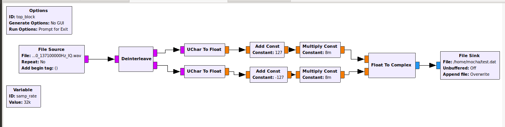
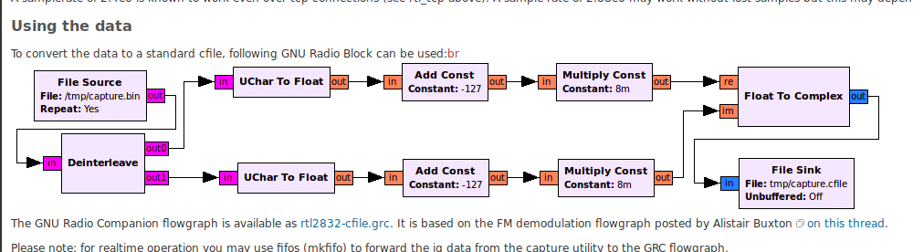
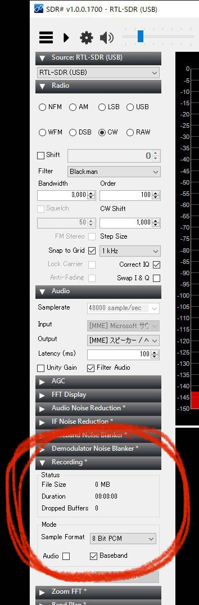

# sdr_sharp_file_convert_gqrx_file

- Ref. [1] https://osmocom.org/projects/rtl-sdr/wiki/Rtl-sdr

## File Source Block
Input File: It got rtl_sdr command, 8bit . Maybe it compatible SDR# record, Recording tab, Mode Sample Format 8bit PCM.

## File Sink Block
Output File: It can use on GQRX, GNU Radio. File size is 4 times from input file.
